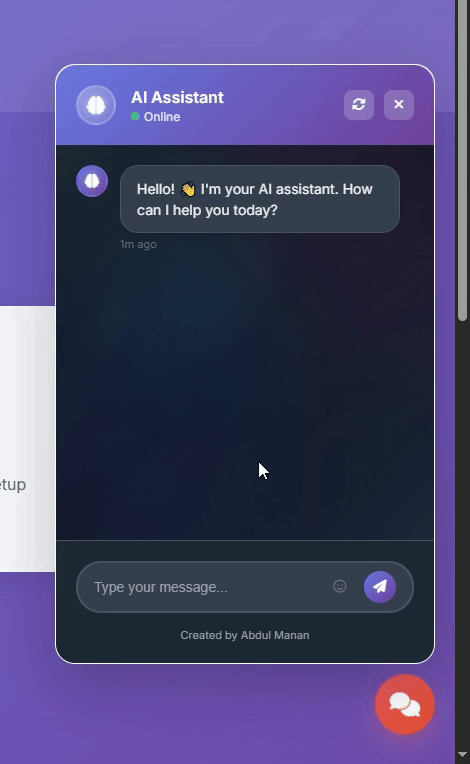

# Reusable Chatbot UI 🚀

A beautiful, reusable chatbot interface for modern websites. This chatbot UI comes with smooth animations, gradient designs, and a professional look that works out of the box.



## 🌟 Live Demo
**[Live Demo](https://abdulmanan133.github.io/chatbot-Ui/)**


## ✨ Features

- **🎨 Modern Design** - Beautiful gradient UI with smooth animations
- **📱 Fully Responsive** - Works perfectly on desktop, tablet, and mobile
- **🔧 Easy Integration** - Drop-in solution with minimal setup
- **⚡ Fast & Lightweight** - Vanilla JavaScript, no dependencies
- **🎯 Customizable** - Easy to theme and modify for your brand
- **💬 Rich Interactions** - Typing indicators, message history, and emojis

## 🚀 Quick Start

### 1. Download Files
- `chatbot.css` - The stylesheet
- `chatbot.js` - The JavaScript functionality
- `index.html` - Demo page

### 2. Basic Integration

```html
<!-- Include the CSS -->
<link rel="stylesheet" href="chatbot.css">

<!-- Include Font Awesome for icons -->
<link rel="stylesheet" href="https://cdnjs.cloudflare.com/ajax/libs/font-awesome/6.4.0/css/all.min.css">

<!-- Add the chatbot HTML (see integration guide for full structure) -->
<div id="reusable-chatbot">
    <!-- Chatbot structure here -->
</div>

<!-- Include the JavaScript -->
<script src="chatbot.js"></script>

<!-- Initialize -->
<script>
new ReusableChatbot({
    botName: 'Your Assistant',
    welcomeMessage: 'Hello! How can I help you today?',
    responses: {
        'hello': 'Hi there! Welcome!',
        'help': 'I\'m here to help you!',
        'default': 'Thanks for your message!'
    }
});
</script>
```

## 📖 Integration Guide

For detailed setup instructions, customization options, and API integration, check out [Integration Guide](integration-guide.html).

## ⚙️ Configuration Options

| Option | Type | Default | Description |
|--------|------|---------|-------------|
| `botName` | string | 'AI Assistant' | Bot name in header |
| `welcomeMessage` | string | 'Hello! How can I help?' | First message |
| `apiEndpoint` | string | null | Your chat API URL |
| `responses` | object | {...} | Predefined responses |

## 🎨 Customization

Easy to customize with CSS variables:

```css
:root {
    --chatbot-primary: linear-gradient(135deg, #your-color1, #your-color2);
    --chatbot-text: #your-text-color;
}
```

## 📱 Browser Support

- Chrome 60+
- Firefox 60+
- Safari 12+
- Edge 79+

## 📄 License

Feel free to use it in your projects!😉

---


Made with ❤️ for developers. Star this repo if you find it useful!


